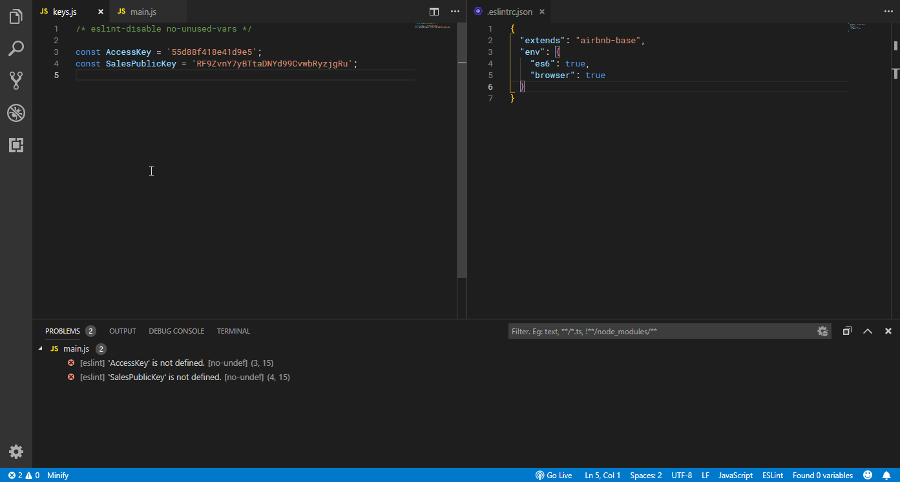

# Add to Globals

## Introduction

Add to Globals allows you to easily add, modify or remove global variables from your JSHint or ESLint config file.

## Supported Files

The extension supports JSON config files only.

**JSHint** - .jshintrc
**ESLint** - .eslintrc.json

## Commands

| Command      | Action         |
| -------------|:-------------: |
| atg.true     | Add an overwritable variable |
| atg.false    | Add a read-only variable |
| atg.remove   | Remove variable from config file |

## Keyboard Shortcuts

This are the default keyboard shortcuts. You can always change them to whatever you want in the VS Code settings.

| Shortcut      | Action         |
| -------------|:-------------: |
| Ctrl + Alt + A | Add a variable that can be overwritten |
| Ctrl + Alt + S    | Add a read-only variable |
| Ctrl + Alt + D    | Remove variable from config file |

## License

[MIT](./LICENSE.MD)

## Icon

'Globe' icon by [Icon Lauk](https://dribbble.com/iconlauk) from [iconfinder.com](https://www.iconfinder.com/icons/3915750/globe_gps_location_maps_navigation_icon).